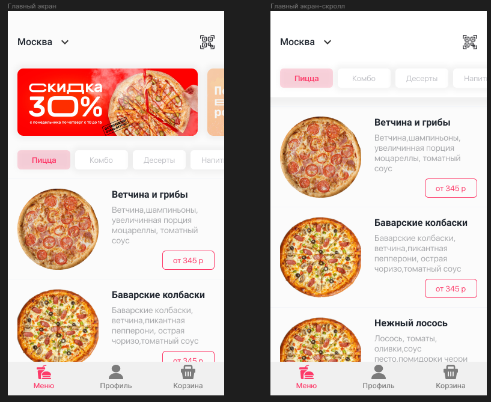
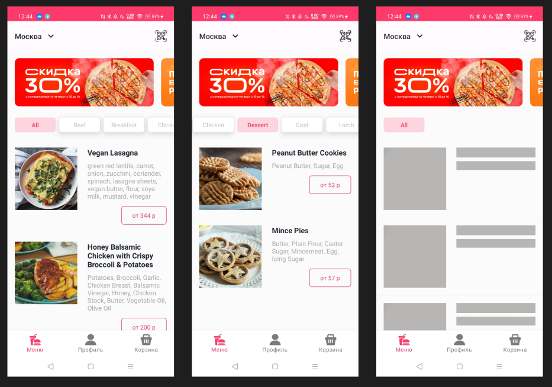

# DeliveryApp
### Приложение для просмотра и доставки еды

### Что надо было сделать:
* Главный экран приложения доставки еды
* В баннеры можно захардкодить любые фото
* Основная задача - сделать идентичную планку с категориями и блок меню
* Планка с категориями при скролле должна прилипать к верхнему бару (для примера можно посмотреть приложение Додо Пицца).
* В качестве API использовать любой открытый источник подходящий под текущие нужды

### Что было сделано:
* Получение из сети информации о блюдах, её отображение на экране с плейсхолдером на время загрузки
* Фильтрация блюд по категориям
* "Прилипание" панели с категориями при скролле вниз
* Возможность заново сделать запрос в сеть через кнопку "перезагрузить", если прошлый запрос не удался

### Использованный стек:
* Kotlin
* Jetpack Compose
* ImmutableCollections
* Flow
* Kotlin Coroutines
* Retrofit
* Gson
* Dagger 2
* Glide
* Fragments

### Ожидание и результат:
**Ожидания:**

**Результат:**
